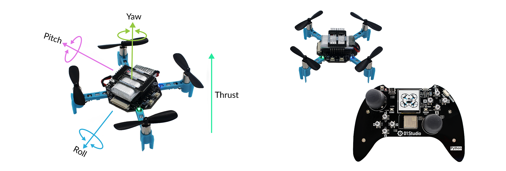
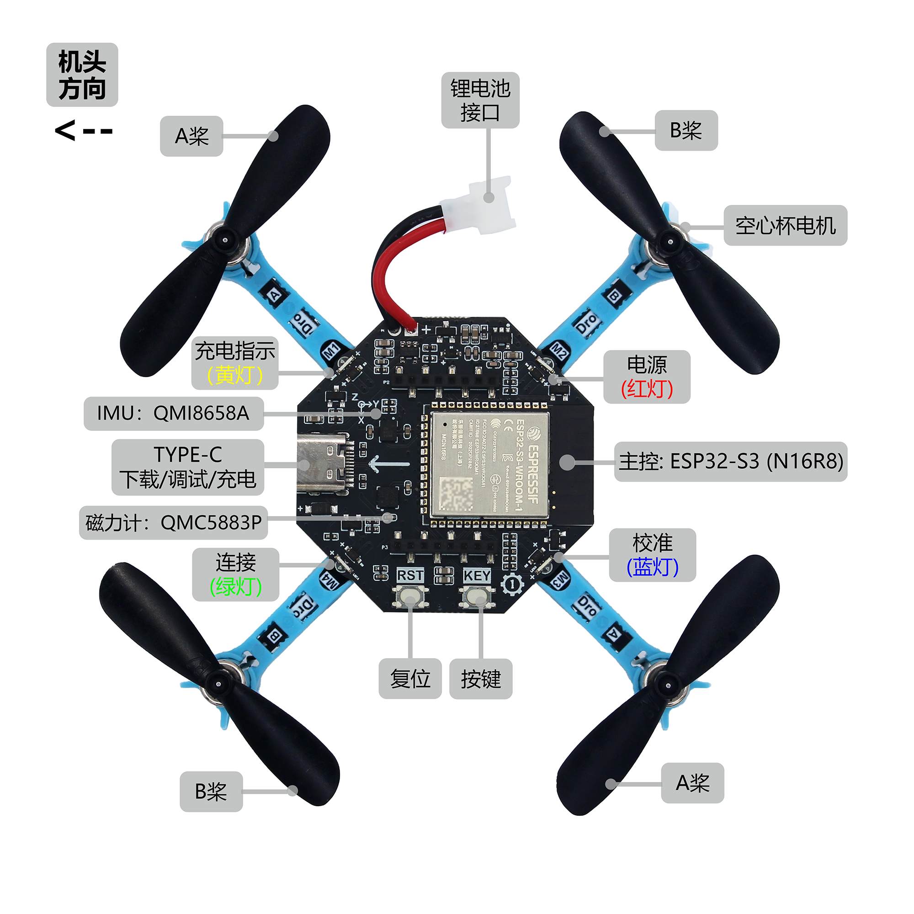
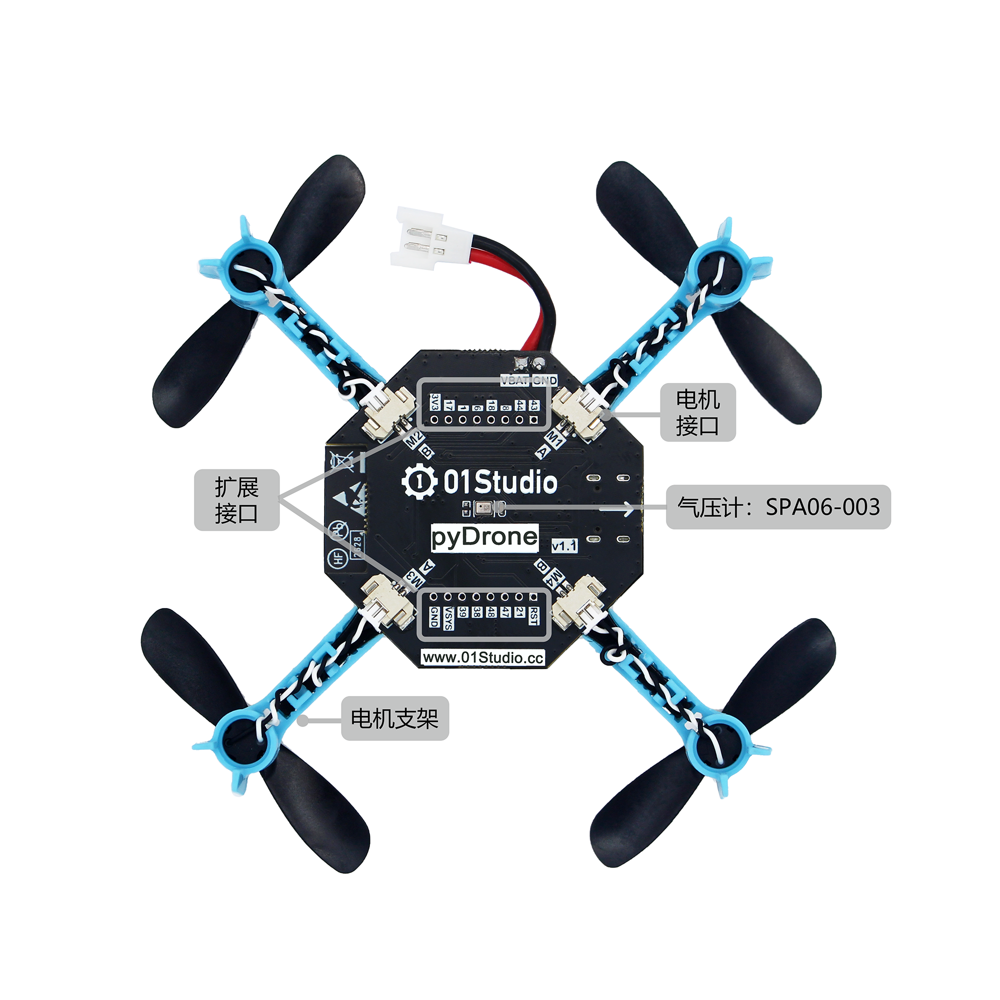

# pyDrone

**English** | [中文](README_zh.md)



## Introduction

MicroPython is a way to program all kinds of embedded hardware devices using Python. MicroPython is growing rapidly, and 01Studio has long been committed to embedded Python programming — that's why we created the pyDrone open-source project, aiming to make MicroPython even more popular. With MicroPython, you can easily implement a quadcopter's takeoff, landing, hovering, movement, self-rotation, and various other attitudes and actions.

Example:
```python
from drone import DRONE

# Create a quadcopter object
d = DRONE(flightmode = 0) # Headless mode

# Usage

# Take off
d.takeoff()

# Land
d.landing()

# Quadcopter attitude control
d.control(rol = 0, pit = 0, yaw = 0, thr = 0)

...
```

## Hardware Resources

pyDrone v1.1 [click to buy>>](https://www.aliexpress.com/item/1005009354821307.html)





- MCU: ESP32-S3-WROOM-1 (N16R8; Flash: 16 MBytes, RAM: 8 MBytes), supports WiFi/BLE
- 4 x LED (charging indicator [orange], power indicator [red], calibration indicator [blue], network indicator [green])
- 4 x 716 coreless motors
- 2 x buttons (1 reset button + 1 function button)
- 1 x IMU (QMI8658A)
- 1 x barometer (SPA06-003)
- 1 x electronic compass (QMC5883P)
- 1 x USB Type-C (download / REPL debugging / power supply)
- 1 x module expansion interface (2x8Pin 2.0mm pitch female header)
- 1 x 400mAh / 3.7V Li-Po battery (onboard charging circuit)
- 1 x battery cover
- 1 x propeller guard

## Directory Structure

```
pyDrone/
├── examples/          # Example code
├── hardware/          # Hardware design resources (schematics, footprints, 3D models)
├── firmware/          # Firmware
├── app/               # Android app
├── CHANGELOG.md       # Changelog
├── LICENSE
├── README.md          # English documentation
└── README_zh.md       # Chinese documentation
```

## Development Resources

- [Wiki (Tutorials & Documentation)](https://wiki.01studio.cc/docs/pydrone)

## Changelog

Please refer to [CHANGELOG.md](CHANGELOG.md).

## Technical Support

If you run into any problems, you can get support through the following channel:

**Email**: Send an email to [support@01studio.cc](mailto:support@01studio.cc).
