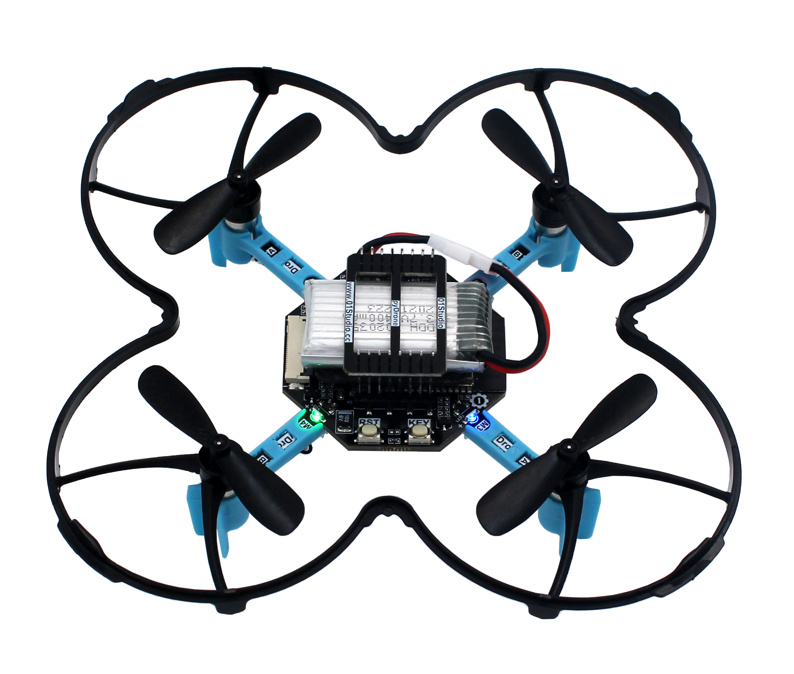

.. _pyDrone_quickref:

pyDrone用户手册
=============================

硬件资源
---------

* `pyDrone 原理图 <https://www.01studio.cc/data/sch/pyDrone_Sch.pdf>`_ (PDF)

教程资料
-----------------
pyDrone主控为ESP32-S3，基于MicroPython实现，01Studio提供完整的入门教程和代码相关资料:

https://download.01studio.cc/zh_CN/latest/project/pyDrone/pyDrone.html

构造函数
------------

.. class:: drone.DRONE(flightmode = 0)

    构建四轴对象。
	
	- ``flightmode`` 飞行模式。
	
		- ``0`` - 无头模式。表示以周围环境为参照系，飞行的前后左右方向跟机身无关，通常用于室内飞行；
		- ``1`` - 有头模式。表示以四轴机身为参照系，飞行的前后左右方向跟机身有关。四轴自转后保持机头方向为正前方，通常用于室外飞行。
	
示例::

	import drone

	d = drone.Drone(flightmode = 0) #构建四轴对象,无头飞行模式。

动作
-----

.. method:: DRONE.read_cal_data()

    获取校准数据。返回3个融合的X/Y/Z校准数据值，当3个值均少于5000时候，校准通过。

.. method:: DRONE.read_calibrated()

    获取校准状态。校准通过返回1，不通过返回0。
    对象构建后自动开始校准，请尽量将四轴水平放置以便提高校准速度。校准时间通常在启动后10秒内完成。

.. method:: DRONE.take_off(distance = 80)

    起飞:
   
	- ``distance`` 起飞后悬停高度，默认80cm。可以设置范围 30-2000cm：

.. method:: DRONE.landing()

    降落：四轴飞行器缓慢降落，这时候可以控制前后左右方向，降到底面后电机停止转动。

.. method:: DRONE.stop()

    停止：所有电机立刻停止转动，用于突发情况迫降。

.. method:: DRONE.control(rol = 0, pit = 0, yaw = 0, thr = 0)

   四轴飞行器姿态控制:
   
	- ``rol`` Roll横滚角，控制四轴左右运动。范围: -100 ~ 100 ，“-”表示左，正表示右，绝对值越大，角度/油门越大。
	- ``pit`` Pitch俯仰角，控制四轴前后运动。范围: -100 ~ 100 ，“-”表示后，正表示前，绝对值越大，角度/油门越大。
	- ``yaw`` Yaw偏航角，控制四轴自转运动。范围: -100 ~ 100 ，“-”表示逆时针自转，正表示顺时针自转，绝对值越大，角度/油门越大。
	- ``thr`` Thrust推力，控制四轴上下运动。范围: -100 ~ 100 ，“-”表示下降，正表示抬升，绝对值越大，油门越大。

.. method:: DRONE.read_states()

	读取四轴飞行器状态信息。返回9个数据的元组。
	
	1、	roll值，范围[-18000 ~ 18000 ] ，角度放大100倍。
	
	2、	pitch值，范围[-18000 ~ 18000 ] ，角度放大100倍。
	
	3、	yaw值，范围[-18000 ~ 18000 ] ，角度放大100倍。
	
	4、	遥控器 roll 控制量，范围[-1000 ~ 1000 ]   
	
	5、	遥控器 pitch控制量，范围[-1000 ~ 1000 ]  
	
	6、	遥控器 yaw 控制量，范围[-200 ~ 200 ]   
	
	7、	遥控器 Thrust控制量，范围[0 ~ 100 ] ,百分比，摇杆回中时候约为50，即50%。
	
	8、	电池电量,单位10mV。 
	
	9、	相对高度，单位cm（与校准时候的相对高度）。   

WiFi连接
----------

The :mod:`network` module::

    import network

    wlan = network.WLAN(network.STA_IF) # 创建 station 接口
    wlan.active(True)       # 激活接口
    wlan.scan()             # 扫描允许访问的SSID
    wlan.isconnected()      # 检查创建的station是否连已经接到AP
    wlan.connect('essid', 'password') # 连接到指定ESSID网络
    wlan.config('mac')      # 获取接口的MAC地址
    wlan.ifconfig()         # 获取接口的 IP/netmask(子网掩码)/gw(网关)/DNS 地址

    ap = network.WLAN(network.AP_IF) # 创捷一个AP热点接口
    ap.config(essid='ESP-AP') # 激活接口
    ap.config(max_clients=10) # 设置热点允许连接数量
    ap.active(True)         # 设置AP的ESSID名称

连接到本地WIFI网络的函数参考::

    def do_connect():
        import network
        wlan = network.WLAN(network.STA_IF)
        wlan.active(True)
        if not wlan.isconnected():
            print('connecting to network...')
            wlan.connect('essid', 'password')
            while not wlan.isconnected():
                pass
        print('network config:', wlan.ifconfig())

一旦网络建立成功，你就可以通过 :mod:`socket <usocket>` 模块创建和使用 TCP/UDP sockets 通讯,
以及通过 ``urequests`` 模块非常方便地发送 HTTP 请求。

